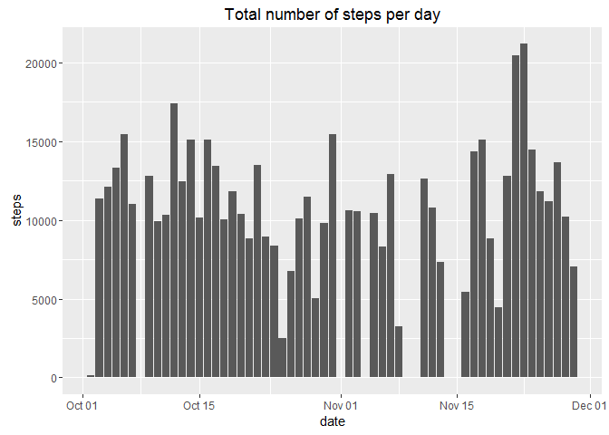
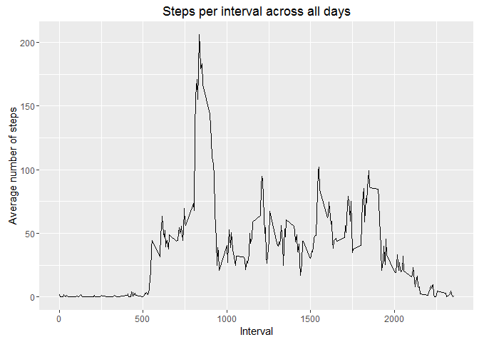
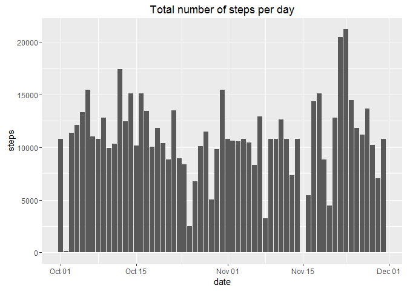
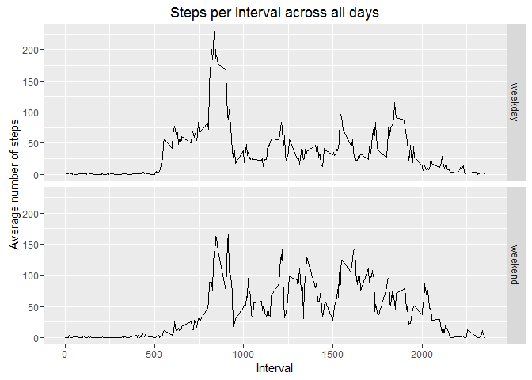

# Reproducible Research: Peer Assessment 1
## Introduction
This project is on analysing data from activity monitoring devices. The data set used contains data about the number of steps walked by a person during 5 minute intervals obtained in October and November 2012.
This dataset will be explored a bit using graphics and descriptive statistics.

Another purpose of this project is getting to know the tools for reproducible research like RMarkdown.


## Requirements
All plots in this report are made using the ggplot2 package.

```r
library(ggplot2)
```
For data manipulation the plyr package is used.

```r
library(plyr)
```


## Loading and preprocessing the data

The data is present in csv format in a zip file. This can be loaded conveniently with the read.csv() function in conjunction with unz(), in order to avoid any steps like unpacking by hand.

```r
data <- read.csv(unz("activity.zip", "activity.csv"))
```
For a first impression the structure of the dataframe is displayed and a simple summary is done.

```r
str(data)
```

```
## 'data.frame':	17568 obs. of  3 variables:
##  $ steps   : int  NA NA NA NA NA NA NA NA NA NA ...
##  $ date    : Factor w/ 61 levels "2012-10-01","2012-10-02",..: 1 1 1 1 1 1 1 1 1 1 ...
##  $ interval: int  0 5 10 15 20 25 30 35 40 45 ...
```

```r
summary(data)
```

```
##      steps                date          interval     
##  Min.   :  0.00   2012-10-01:  288   Min.   :   0.0  
##  1st Qu.:  0.00   2012-10-02:  288   1st Qu.: 588.8  
##  Median :  0.00   2012-10-03:  288   Median :1177.5  
##  Mean   : 37.38   2012-10-04:  288   Mean   :1177.5  
##  3rd Qu.: 12.00   2012-10-05:  288   3rd Qu.:1766.2  
##  Max.   :806.00   2012-10-06:  288   Max.   :2355.0  
##  NA's   :2304     (Other)   :15840
```
For further analysis the date has to be in date format. Checking the current class of date gives an unsatisfactory result.

```r
class(data$date)
```

```
## [1] "factor"
```
This can easily be converted to the desired date class.

```r
data$date <- as.Date.factor(data$date)
```
The conversion was successful as can be seen by

```r
class(data$date)
```

```
## [1] "Date"
```
For some analyses it is more convenient to have the interval variable as a factor. However, some plots will require the original integer format. So a new column is added to the dataframe with interval as factor.

```r
data$intervalFac <- as.factor(data$interval)
class(data$intervalFac)
```

```
## [1] "factor"
```

```r
class(data$interval)
```

```
## [1] "integer"
```
So both formats are present now.

A last checkup of the dataframe prior to the analytical work shows everything looks fine now.

```r
str(data)
```

```
## 'data.frame':	17568 obs. of  4 variables:
##  $ steps      : int  NA NA NA NA NA NA NA NA NA NA ...
##  $ date       : Date, format: "2012-10-01" "2012-10-01" ...
##  $ interval   : int  0 5 10 15 20 25 30 35 40 45 ...
##  $ intervalFac: Factor w/ 288 levels "0","5","10","15",..: 1 2 3 4 5 6 7 8 9 10 ...
```

```r
summary(data)
```

```
##      steps             date               interval       intervalFac   
##  Min.   :  0.00   Min.   :2012-10-01   Min.   :   0.0   0      :   61  
##  1st Qu.:  0.00   1st Qu.:2012-10-16   1st Qu.: 588.8   5      :   61  
##  Median :  0.00   Median :2012-10-31   Median :1177.5   10     :   61  
##  Mean   : 37.38   Mean   :2012-10-31   Mean   :1177.5   15     :   61  
##  3rd Qu.: 12.00   3rd Qu.:2012-11-15   3rd Qu.:1766.2   20     :   61  
##  Max.   :806.00   Max.   :2012-11-30   Max.   :2355.0   25     :   61  
##  NA's   :2304                                           (Other):17202
```


## What is mean total number of steps taken per day?
A histogram gives a graphical representation of the total number of steps taken each day.

```r
ggplot(data, aes(date, steps)) +
  geom_bar(stat = "identity") + 
  labs(title = "Total number of steps per day")
```

```
## Warning: Removed 2304 rows containing missing values (position_stack).
```

<!-- -->

The first descriptive question is the mean total number of steps taken per day. This question is not entirely clear defined. Does this mean to calculate a score for each day, or does this mean a grand average over all days. Since the score per interval per day is calculated later, I decide to interpret this question as asking for the grand average. 

In order to calculate the mean median over all days during the observation period, the sum per day is needed first.

```r
sumPerDay1 <- tapply(data$steps, data$date, sum)
```
The mean is calculated as follows.

```r
meanPerDay1 <- mean(sumPerDay1, na.rm = TRUE)
meanPerDay1
```

```
## [1] 10766.19
```

However, this mean is confounded by the specific missing value pattern, as shall be shown later. Calculated differently (total number of steps divided by number of days), a very different mean is obtained.

```r
#Number of days
days <- nrow(sumPerDay1)
#Total number of steps
totalSteps1 <- sum(sumPerDay1, na.rm = TRUE)
#Mean is total sum divided days
meanPerDay1a <- totalSteps1/days
meanPerDay1a
```

```
## [1] 9354.23
```


The median is equivalently calculated as follows.

```r
median1 <- median(sumPerDay1, na.rm = TRUE)
median1
```

```
## [1] 10765
```


## What is the average daily activity pattern?
For this pattern analysis a time series plot is made. To this end, interval means must be calculated.

```r
data <- ddply(data, ~ intervalFac, transform, avgInt = mean(steps, na.rm = TRUE))
data[order(data$date), ] 
```
This gives the following time series plot.

```r
ggplot(data, aes(interval, avgInt)) +
  geom_line() +
  labs(title = "Steps per interval across all days") +
  labs(x = "Interval") +
  labs(y= "Average number of steps")
```

<!-- -->

For determining which 5-minute interval on average across all days contains the maximum number of steps the max() function can be applied, and after some format processing the single value for the interval indicator is obtained.

```r
intMax1 <- data$intervalFac[data$avgInt==(max(data$avgInt))]
intMax1 <- as.character(intMax1)
intMax1 <- head(intMax1, n=1)
intMax1
```

```
## [1] "835"
```


## Imputing missing values
In order to get to know, whether there a lots of missing values, this number is calculated for the steps variable.

```r
numNA <- sum(is.na(data$steps))
numNA
```

```
## [1] 2304
```
This is quite a substantial number - more than 10% of the data, give the fact that there are 17568 observations/measurements in total, so imputing missing values might improve the analysis.

Several options were considered in the project description. Not all are successful as will be shown.
First, imputing the average daily value was considered. This was done as follows.

```r
impute.mean <- function(x) replace(x, is.na(x), mean(x, na.rm = TRUE))
data2 <- ddply(data, ~ date, transform, steps = impute.mean(steps))
```
However, checking the effect and hoping for no more NA's is disappointing.

```r
numNA2 <- sum(is.na(data2$steps))
numNA2
```

```
## [1] 2304
```
Carefull inspection of the dataset showed, that all missing values occur grouped by date! So, if there were missing values, then there were no measurements at all at that day, so this strategy for impuation had to fail.

Another option is imputing the interval average. This stragegy should be successfull, given the findings on the NA pattern above.
Imputation was done as follows.

```r
impute.mean <- function(x) replace(x, is.na(x), mean(x, na.rm = TRUE))
data3 <- ddply(data, ~ intervalFac, transform, steps = impute.mean(steps))
```
As expected, this approach is successfull.

```r
numNA3 <- sum(is.na(data3$steps))
numNA3
```

```
## [1] 0
```

Replicating the analysis on mean values gives the following results.
Histogram:

```r
ggplot(data3, aes(date, steps)) +
  geom_bar(stat = "identity") + 
  labs(title = "Total number of steps per day")
```

<!-- -->
No more gaps are present.

N.B. What might look like missing on November 15th, is in reality such a small number of steps taken that is is not visible in this graph representation.

The mean is calculated again.

```r
sumPerDay2 <- tapply(data3$steps, data3$date, sum)
meanPerDay2 <- mean(sumPerDay2) #no na.rm should be required any more!
meanPerDay2
```

```
## [1] 10766.19
```
For comparison the old value calculated with the mean() fucntion was 1.0766189\times 10^{4}.
As can be expected, for the overall average, impuation of missing values has almost no influence on the mean, due to the mean as imputation method.

But what happens if we compare the second method of calculating the mean, thus dividing the total number of steps by the number of days?

```r
#Total number of steps
totalSteps2 <- sum(sumPerDay2)
#Mean is total sum divided days
meanPerDay2 <- totalSteps2/days
meanPerDay2
```

```
## [1] 10766.19
```
Here we see the problem mentioned above. The old value was 9354.2295082. 
The mean calculation is very dependent on the method used and things like missing value patterns. 

Also the median is calculated again.

```r
median2 <- median(sumPerDay2) #again, no na.rm should be required any more!
median2
```

```
## [1] 10766.19
```
Comparing with the old median, 10765, this is no big change. Due to imputing the mean, this value naturally occurs now more often, which makes it the obvious candidate for the new median.
Also notice, that this demonstration prooves the median to be a much more robust measure of central tendency than the mean, since here are no ambiguities in calculation and possible results as it is for the mean.


## Are there differences in activity patterns between weekdays and weekends?
First a factor for distinguishing between weekdays and weekends is needed.

```r
data3$weekday <- weekdays(data3$date)
```
The actual days have to be replaced by the required 2 levels and a true factor conversion has to be done.

```r
revalue(data3$weekday, c("Monday" = "weekday",
                         "Tuesday" = "weekday",
                         "Wednesday" = "weekday",
                         "Thursday" = "weekday",
                         "Friday" = "weekday",
                         "Saturday" = "weekend",
                         "Sunday" = "weekend")) -> data3$weekday

data3$weekday <- as.factor(data3$weekday)
```

Next, the interval average per day is needed, based on the imputed dataframe and grouped by the weekday factor. This variable is added to the dataframe.

```r
data3 <- ddply(data3, .(intervalFac, weekday), transform, avgInt = mean(steps))
data3[order(data3$date), ] 
```

Successfull data manipualtion is explored briefly with str() and summary().

```r
str(data3)
```

```
## 'data.frame':	17568 obs. of  6 variables:
##  $ steps      : num  1.72 0 0 47 0 ...
##  $ date       : Date, format: "2012-10-01" "2012-10-02" ...
##  $ interval   : int  0 0 0 0 0 0 0 0 0 0 ...
##  $ intervalFac: Factor w/ 288 levels "0","5","10","15",..: 1 1 1 1 1 1 1 1 1 1 ...
##  $ avgInt     : num  2.25 2.25 2.25 2.25 2.25 ...
##  $ weekday    : Factor w/ 2 levels "weekday","weekend": 1 1 1 1 1 1 1 1 1 1 ...
```

```r
summary(data3)
```

```
##      steps             date               interval       intervalFac   
##  Min.   :  0.00   Min.   :2012-10-01   Min.   :   0.0   0      :   61  
##  1st Qu.:  0.00   1st Qu.:2012-10-16   1st Qu.: 588.8   5      :   61  
##  Median :  0.00   Median :2012-10-31   Median :1177.5   10     :   61  
##  Mean   : 37.38   Mean   :2012-10-31   Mean   :1177.5   15     :   61  
##  3rd Qu.: 27.00   3rd Qu.:2012-11-15   3rd Qu.:1766.2   20     :   61  
##  Max.   :806.00   Max.   :2012-11-30   Max.   :2355.0   25     :   61  
##                                                         (Other):17202  
##      avgInt           weekday     
##  Min.   :  0.000   weekday:12960  
##  1st Qu.:  2.222   weekend: 4608  
##  Median : 26.810                  
##  Mean   : 37.383                  
##  3rd Qu.: 56.593                  
##  Max.   :230.378                  
## 
```
Nothing unusual is observed, so the time series panel plot can be made.

```r
ggplot(data3, aes(interval, avgInt)) +
  geom_line() +
  facet_grid(weekday ~ .) +
  labs(title = "Steps per interval across all days") +
  labs(x = "Interval") +
  labs(y= "Average number of steps")
```

<!-- -->

The difference between weekdays and weekend is obvious.


